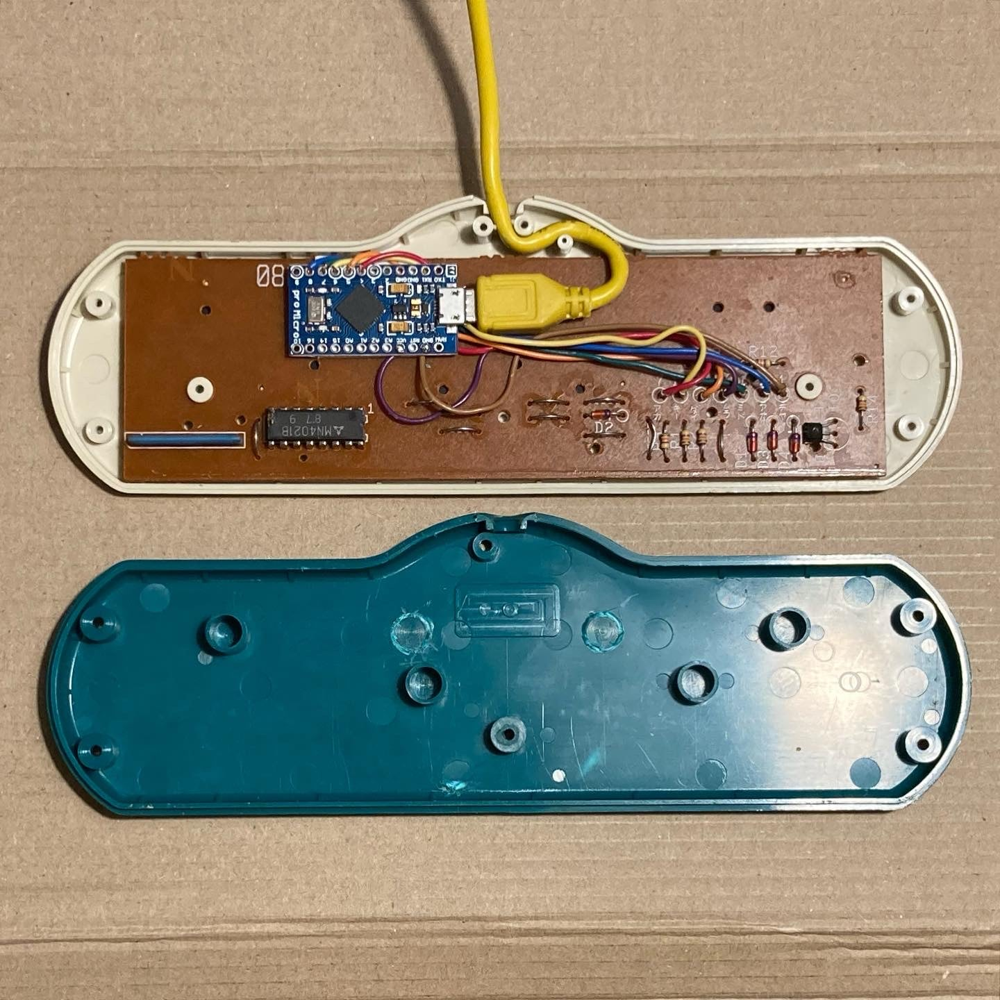

   Based on Arduino Leonardo (ATmega32u4) USB converter for
   Jissen Mahjong controller (aka Capcom, Famicom mahjong controller)
   https://wiki.nesdev.com/w/index.php/Jissen_Mahjong_controller

- The controller contains one 8-bit 4021 shift register and one transistor 
  in switch mode for selecting buttons lines.
- This shift register takes parallel inputs from buttons and converts them 
  into a serial output.
- There is three lines with buttons [A]-[H], [I]-[N], [SEL]-[RON]  
- This code first selects a buttons line then latches the data and then shifts 
  in the first bit on the data line. 
  Then it clocks and shifts in on the data line until all bits are received.
  Then selects next buttons line and repeat procedure.
- What is debugged are the button states of the mahjong controller.
- A logical "1" means the button is not pressed. A logical "0" means the button is
  pressed.
- This code shifts the first bit of data into the LSB.
- The order of shifting for the buttons is shown in the table below:

        Bit# | FMC MJ Buttons   
        -----------------------
          0  | H | - | -      |   
        -----------------------
          1  | G | - | RON    |   
        -----------------------
          2  | F | N | RIICHI |    
        -----------------------
          3  | E | M | CHI    |   
        -----------------------
          4  | D | L | PON    |   
        -----------------------
          5  | C | K | KAN    |   
        -----------------------
          6  | B | J | ST     |    
        -----------------------
          7  | A | I | SEL    |    
        -----------------------
        
- The mahjong controller pinout is shown below (looking into controller's
  connector end):
  1  - Ground (BRO wire),
  7  - Data Out (RED wire),
  9  - Clock (ORA wire),
  10 - I-N buttons row (BLU wire),
  11 - A-H buttons row (GREE wire),
  12 - Latch (YEL wire),
  15 - +5V also command buttons row (PUR wire),
  other pins have no connection.

- For the Jissen Mahjong controller, data must be read three times. Each time, 
  the logical state of the two wires - A-H (pin 11, green wire) and I-N (pin 10, blue wire)
  selects which row is currently being read. If they both in HIGH state - command buttons
  row being read. If A-H is HIGH and I-N is LOW - I-N buttons row being read.
  If A-H is LOW and I-N is HIGH - A-H buttons row being read.
- Based on NES gamepad arduino code from here:
  https://www.allaboutcircuits.com/projects/nes-controller-interface-with-an-arduino-uno/

# Example install

This install uses an Arduino Compatible Pro Micro (ATMega 32U4), 5V/16MHz version.

